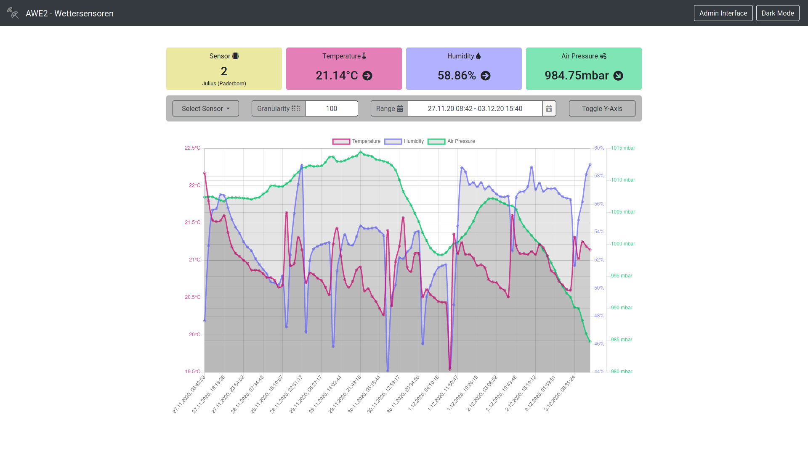
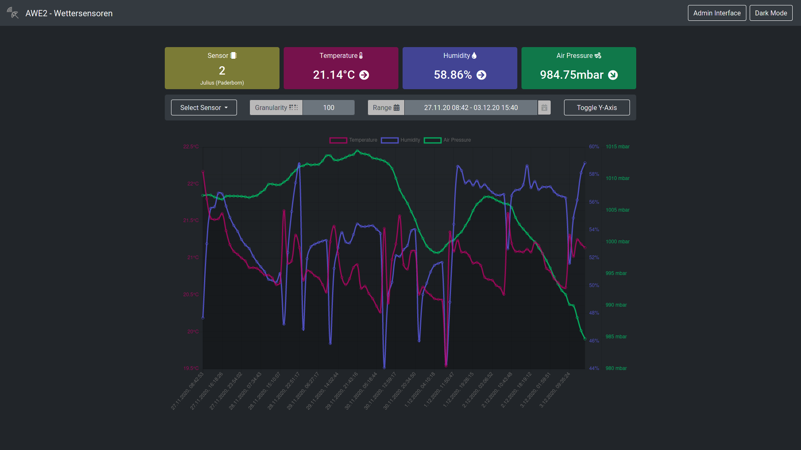

# Former university project "Weathersensors" 
This project was originally developed in the context of the module "Application Development 2" at the FHDW Paderborn (Releases <1.1.0).
After finishing the module, this project was developed further voluntarily (Releases >=1.1.0).
 
GUI (lightmode) | GUI (darkmode)
:-------------------------:|:-------------------------:
   |   

In the course of this project NodeMCU ESP8266 will be equipped with BME280 sensors (temperature, air pressure and humidity sensor).
These send the collected data to a central server, which manages the data. 
These data can be retrieved in visual form via a web server.

### Build Status:  
### [Live Version](https://awe2.jeujeus.de)

## Features:
### state 1.0.x :
- collecting weather data from 'n' different sensors
- sensor activity indicator for overview of active sensors
- exact time stamp of last activity for inactive sensors
- selection of the sensor to be plotted
- secure admin interface for the administration of the sensors
- graphic display of temperature, humidity and air pressure curves
- freely selectable granularity of the representation
- freely adjustable period to be displayed
- quick overview of the last values
### additionally since 1.1.x :
- trend display for the development of temperature / humidity and pressure based on regression forecasts
- darkmode (persistent between sessions)

## Deployment 
### ESP8266
A BME280 sensor is used to collect the weather data, which is controlled by a board with ESP8266 microcontroller
and NodeMCU 1.0 firmware. On the microcontroller the source code ``nodemcu.ino`` can be executed.
For compiling, the Arduino IDE should be used, in which the drivers for the ESP8266 must be installed first.
For this purpose, the following board administrator URL must be added in the preferences: ``http://arduino.esp8266.com/stable/package_esp8266com_index.json``.
In addition, the following libraries must be installed via the integrated library management:

|Library|Version|
|---|---|
|WiFi (by Arduino)|1.2.7|
|Adafruit BME280 Library (by Adafruit)|2.1.1|
|Adafruit Unified Sensor (by Adafruit)|1.1.4|
|EasyNTPClient (by Harsha Alva)|1.1.0|
|LinkedList (by Ivan Seidel)|1.2.3|
 
Before the source code is compiled, the following constants must be adapted to the local conditions:
- ``SERVER_TO_CONNECT``
- ``SSID`` 
- ``WIFI_PASSWORD`` 
- ``API_TOKEN`` (this must be equal to the value set in the backend)

The BME280 sensor and ESP8266 must be connected as follows:

|ESP8266 Pin|BME280 Pinhole|
|---|---|
|3.3V|VIN|
|G|GND|
|D1|SCL|
|D2|SDA|

The exact devices are:
- AZDelivery NodeMCU Lua Lolin V3 Module ESP8266 ESP-12F WIFI 
- AZDelivery GY-BME280 

### backend and frontend
Backend and frontend are deployed using Docker. 
In the frontend, the backend url in the class ``Constants.js`` has to be adapted to the variable ``SERVER_URI``.
The images for this can be built in the respective modules using the ``buildImageandTar.sh`` scripts.
These scripts build the images and make them available in the local docker environment.
Furthermore, tar balls with the respective images are stored in the project root folder.
For this step we decided to make the images available on a server
without having to use Docker Registries (e.g. Docker.io)

The default admin access is ``admin:$PASSWORD``
The password for the admin access - in form of the variable ``$PASSWORD`` in ``router.js`` - is to be replaced in a given dimension.
The API token of the node MCUs must be changed in the form of the variable ``API_TOKEN`` in ``persistanceService.js``, according to the change in ``nodemcu.ino``.

#### deployment requirements under Windows
The project can be deployed using WSL 2 and Docker for Windows.
For the preparation a WSL 2 must be set up first (link to the manual: [here](https://docs.microsoft.com/en-us/windows/wsl/install-win10)).
Then Docker for Windows can be installed with the WSL 2 components (link to instructions: [here](https://docs.docker.com/docker-for-windows/wsl/)).
Now that Docker for Windows has been setup, the selected Linux distribution can be started in the WSL. 
After that, the steps for Linux have to be executed in the WSL.

#### deployment Voraussetzungen unter Linux
In Linux Docker as well as Node and npm are to be installed by the distribution-specific Package Manager. 

#### Backend Start-Command:
```docker run -p 3000:3000 -v $PATH_TO_DATABASE:/usr/src/app/db --name weathersensors-backend -it weathersensors/backend:latest```

```$PATH_TO_DATABASE``` must be replaced with the folder where the database is to be stored on the host system.

#### Frontend Start-Command:
```docker run -p 3344:3344 --name weathersensors-frontend -it weathersensors/frontend:latest```
